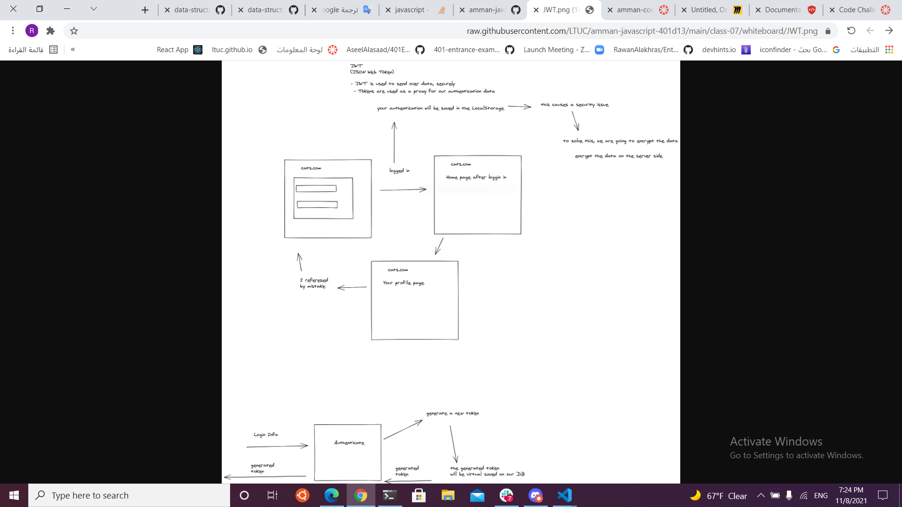
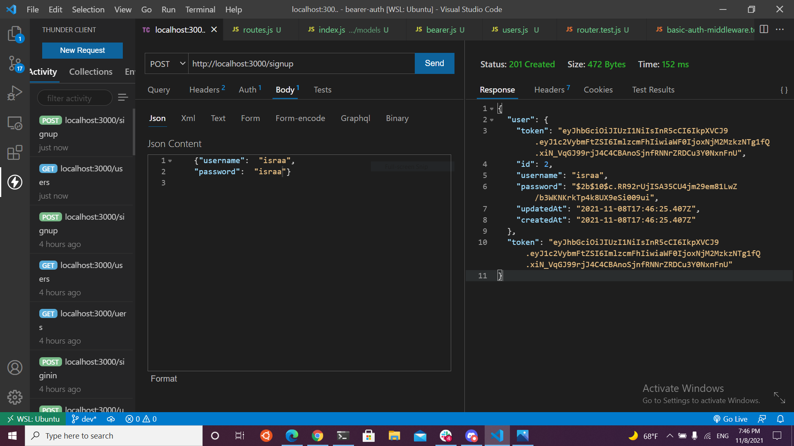
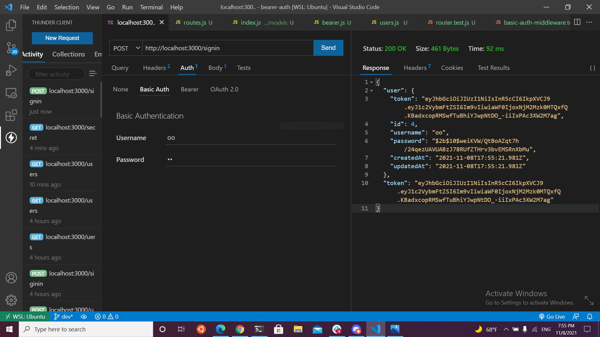
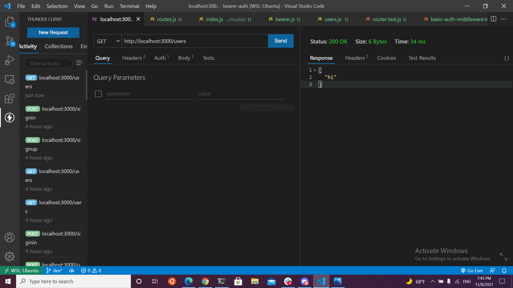
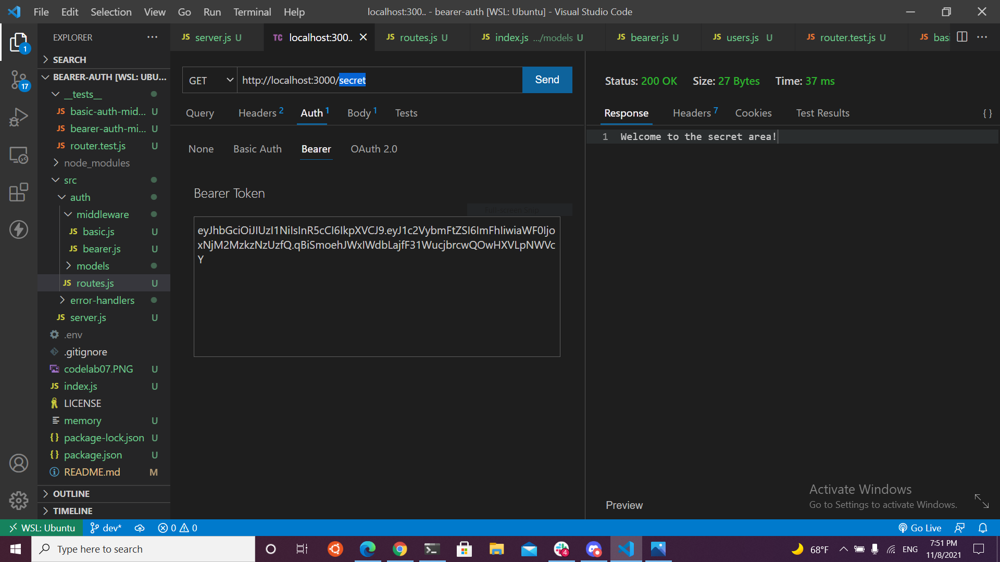

# bearer-auth

## Heroku:

https://lab7raneem.herokuapp.com/

## Github Actions:

https://github.com/raneemabujamous/bearer-auth/actions

## pull request :

https://github.com/raneemabujamous/bearer-auth/pulls

## for create (/signup)

## for login (/signin)

## for get (/users)

## for get (/secret)

## Testing
